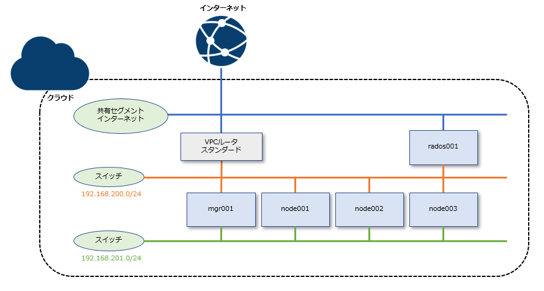

# sakura_ceph_test

## Description
さくらのクラウド上で ceph のテスト環境を構築した際の Terraform のサンプルです。  
以下の構成を作成します。



## Environment
Terraform v0.12.24+  
provider.sakuracloud v2.3.3

## Environment variables
```
SAKURACLOUD_ACCESS_TOKEN
SAKURACLOUD_ACCESS_TOKEN_SECRET
TF_VAR_ssh_pubkey_path
TF_VAR_def_pass
TF_VAR_my_domain
TF_VAR_office_cidr
```

## Usage
```
git clone https://github.com/shztki/sakura_ceph_test
cd sakura_ceph_test
terraform init --backend-config=backend.hcl
terraform plan
terraform apply
```
* バックエンドはリモートにしています。backend.hclファイルは別途作成してください。ローカルで試す場合は main.tf の `backend "remote" {}` 行をコメントアウトしてください。
	* https://www.terraform.io/docs/backends/types/remote.html
	* https://learn.hashicorp.com/terraform/cloud-gettingstarted/tfc_signup

* 別途さくらのクラウド上にドメインのゾーンがある前提になっています。不要な場合は dns.tf を削除してください。

* SSH鍵はローカルで以下のように作成しておいて利用する形です。
```
ssh-keygen -t rsa -C "" -f SSH鍵.rsa -N ""
```